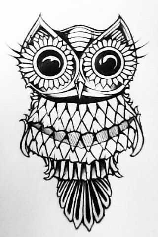

# Spirit Animals
Author: Charlotte Germain

my spirit animal is an owl. 

#facts about owls
* owls are nocturnal
* owls don't make any noise when flying
  + the feathers at the front side of their wings are finer than other birds
* owls are the subject of many myths and superstitions

